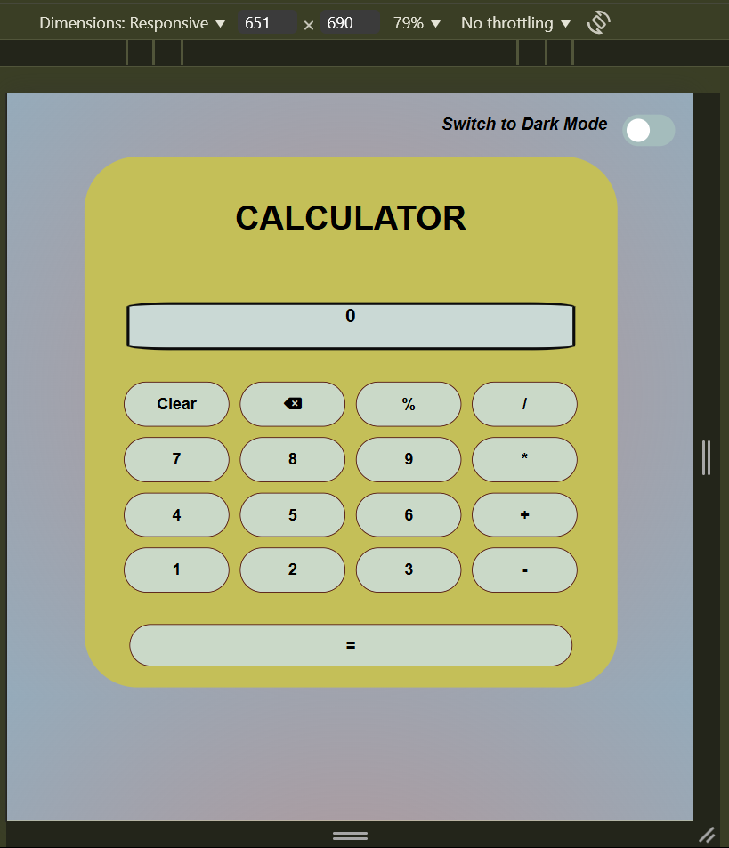
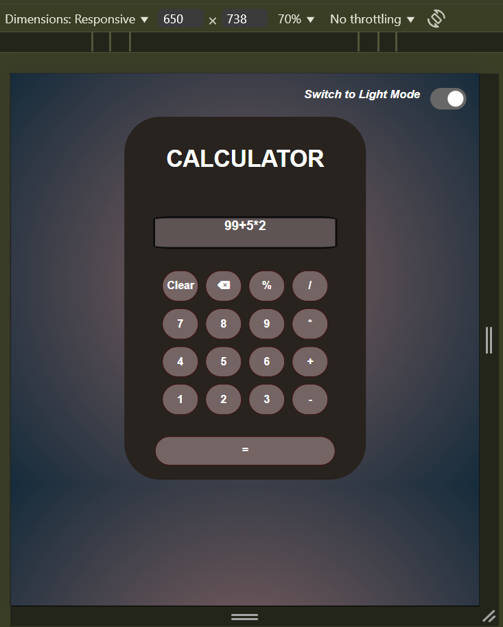

# Calculator

A simple, stylish calculator built using HTML, CSS, and JavaScript — with light/dark mode toggle, clear and backspace functionality, and responsive layout.

## 🚀 Features
- Basic arithmetic operations: `+`, `-`, `*`, `/`, `%`
- Clear and Backspace functionality
- Dark Mode toggle switch 🌙
- Responsive design using CSS Grid & media queries
- Font Awesome icon for a modern look

## 📸 Screenshot

**Light Mode:**

**Dark Mode:**

## 🛠️ Tech Stack

- HTML5  
- CSS3  
- JavaScript (Vanilla)  
- VS Code 🧑‍💻  
- Font Awesome for icon  

## 🌐 Live Demo  
Click below to use the calculator online:  
[Live Demo](https://S-d-13.github.io/Calculator/)

## 👩‍💻 Author
@s-d-13
